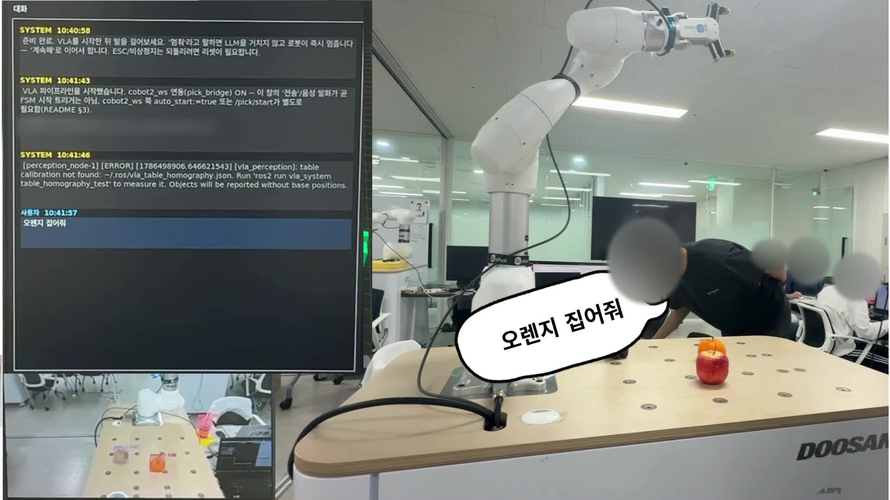
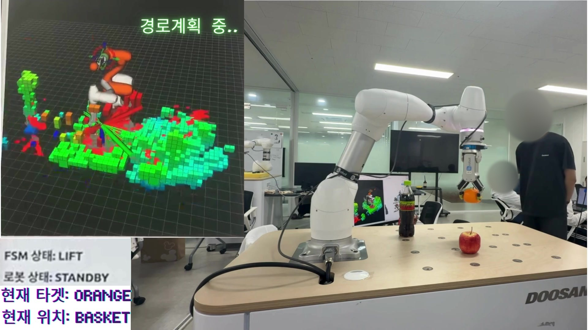
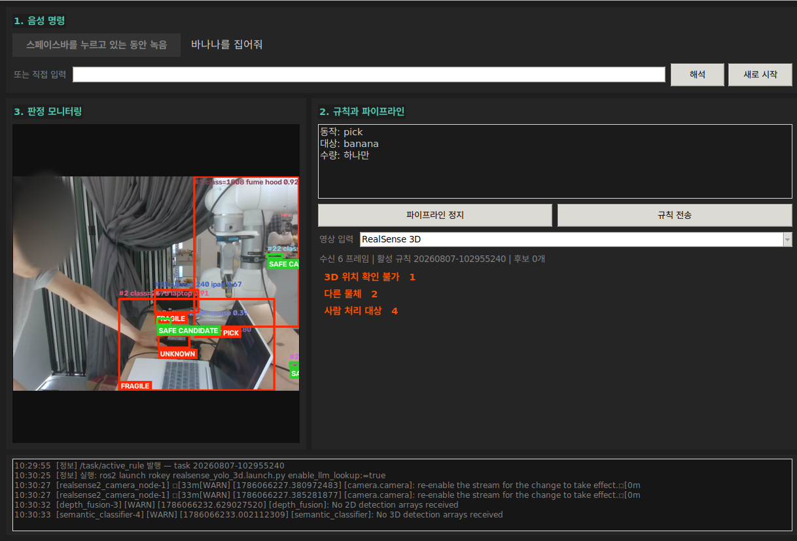
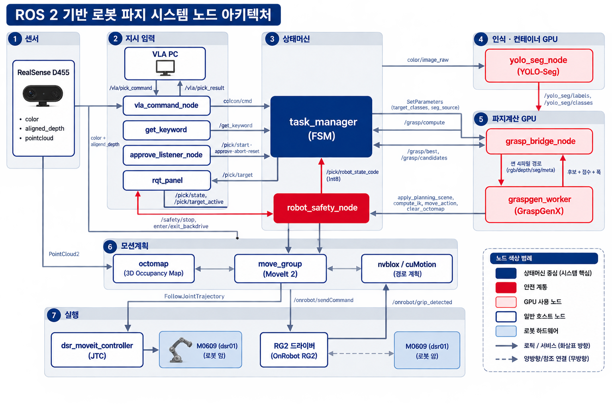
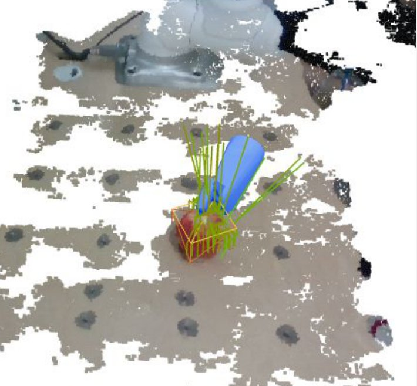
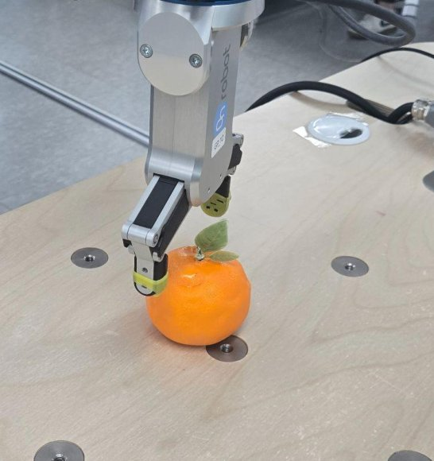
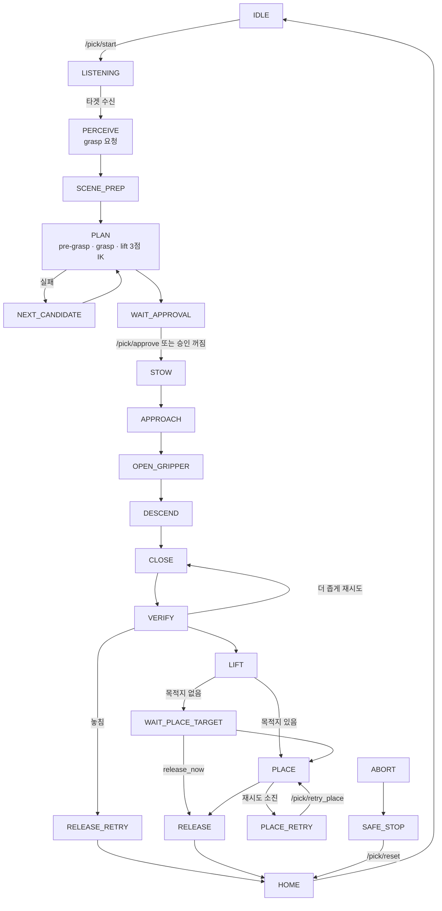
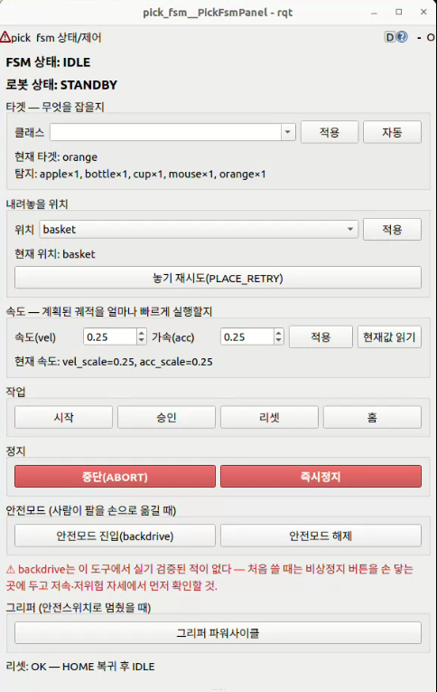

# M0609 VLA Picking System

> 두산로보틱스 ROKEY 부트캠프 협동-2 프로젝트(5인 팀) 제출 스냅샷입니다. 코드는 제출본 그대로이고, 공개용으로 README만 다시 정리했습니다.

> ▶️ **[1분 시연 영상](https://youtu.be/bOec0yE8m94)** — 이 프로젝트를 가장 빨리 파악할 수 있는 자료입니다. 참고 문서는 [더 읽을 문서](#더-읽을-문서)에 있습니다.
>
> 📄 [발표 자료(PDF, 72쪽)](https://github.com/gwanhuiGIM/Rokey_cobot2/releases/download/presentation/cobot2_presentation.pdf) — 세부 기술 발표 자료

자연어로 지시하면 Doosan M0609 + OnRobot RG2가 고정 카메라로 물체를 인식하고, 집어서 지정한 곳에 놓습니다.
사람은 "무엇을 · 몇 개를 · 어디로"만 말하고, 로봇이 어떻게 움직이고 언제 멈출지는 LLM이 아니라 FSM이 정하도록 나눴습니다.

> **핵심 설계**: 판단(LLM)과 실행·안전(FSM)을 서로 다른 노드·패키지로 나누고, 둘 사이는 JSON 채널로만 주고받습니다(명령 `/vla/pick_command`, 결과 `/vla/pick_result`, 상태 `/vla/pick_status`). 모션 취소, 그리퍼 개폐, 물체 보유 상태, 충돌 씬 관리는 코드상 FSM(`task_manager`) 쪽에만 있습니다. 그래서 LLM 응답이 늦거나 틀려도 정지·그리퍼 판단은 FSM 규칙을 따르도록 분리했습니다.

```
사람 ──▶ vla_gui ──▶ agent_node                      판단 계층 (src/vla_system)
         │           ├ Tier 1 규칙 (LLM 없이)
         │           └ Tier 2 gpt-5-mini + 카메라 사진
         │                │ RobotAction
         │                ▼
         └─ "멈춰" ──▶ vla_pick_bridge_node    (멈춰는 LLM을 거치지 않고 bridge로 바로 간다)
                          │ /vla/pick_command (JSON)
        ══════════════════╪══════════════════   ← 계층 경계
                          ▼
                   vla_command_node ──▶ task_manager (pick_fsm)      실행·안전 계층
                   (/pick/* 서비스,      │ grasp 요청
                    /get_keyword 응답)   ├──▶ graspgenx_perception (YOLO-seg + GraspGen 컨테이너)
                                         ▼
                                  moveit_bridge ──▶ move_group (OMPL 기본) ──▶ M0609 + RG2
                   robot_safety_node (별도 프로세스, /safety/*)
```

## 환경 · 장비

<details>
<summary>요구 환경 · 장비 구성</summary>

- Ubuntu 22.04, ROS 2 Humble, Python 3.10
- NVIDIA GPU + CUDA 필수 — GraspGenX와 cuMotion은 CPU로 돌지 않습니다(개발 PC: RTX 4060 Laptop)
- Docker + `nvidia-container-toolkit`(`--gpus all` 지원)

| 구성 요소 | 종류 | 설정 |
| --- | --- | --- |
| Robot | Doosan **M0609** | namespace `dsr01`, IP `192.168.1.100`(`m0609_rg2_bringup` launch) |
| Gripper | OnRobot **RG2** | `src/cobot_rg2`의 xacro·bringup·MoveIt 설정 |
| Vision | Intel RealSense **D435i** × 1 | 🔴 **고정형(eye-to-hand)** — 작업대 옆에 세워 둡니다. 로봇 팔에 달지 않습니다 |
| PC | RTX 4060 Laptop | GraspGenX · cuMotion GPU 연산 |

카메라 위치나 마운트를 바꾸면 eye-to-hand 캘리브레이션을 다시 해야 합니다.

</details>

## 저장소 구성

<details>
<summary>디렉터리 구조 · 저장소에 없는 것</summary>

```
.
├── src/
│   ├── pick_fsm/              실행·안전 계층 — task_manager(FSM) · moveit_bridge · robot_safety_node · rqt 패널
│   ├── pick_fsm_msgs/         ComputeGrasp / AcquireTarget 인터페이스
│   ├── voice_processing/      경계 수신부 vla_command_node (+ 구버전 마이크 노드)
│   ├── graspgenx_perception/  YOLO-seg + GraspGen 파지 자세 계산
│   ├── cobot_rg2/             M0609 + RG2 bringup · MoveIt 설정
│   ├── cumotion/              동적 회피 실험 (pick_fsm 미연결)
│   ├── object_detection/      YOLO 가중치 share 경로
│   ├── vla_system/            판단 계층 — GUI · 에이전트 · 규칙 · bridge
│   ├── vla_interfaces/        판단 계층 내부 메시지 (경계를 넘지 않음)
│   └── PACKAGES.md            패키지별 상세 · FSM 상태도
├── config/                    objects.yaml · cumotion · nvblox 설정
├── docker/                    GraspGenX 컨테이너 (Dockerfile.graspx)
├── docs/                      RUNBOOK · 경계 계약 · 실기 제약 · 이미지
├── scripts/
│   ├── build.sh               빌드 (fsm / vla 분리)
│   ├── fetch_externals.sh     외부 저장소 받기
│   ├── fsm/                   로봇 쪽 보조 스크립트
│   └── vla/                   판단 쪽 보조 스크립트 (env.sh 등)
├── requirements-vla.txt       판단 계층 파이썬 의존성 (393줄)
└── .env.example               API 키 입력 양식
```

### 저장소에 없는 것

| 항목 | 용량 | 받는 법 |
| --- | --- | --- |
| GraspGenX · isaac_ros(cuMotion · nvblox) · Doosan 드라이버 | 20GB+ (제출 당시 참고값) | `./scripts/fetch_externals.sh` |
| `.venv/` | 6.6G (제출 당시 참고값) | `requirements-vla.txt`로 새로 만듭니다 |
| 도커 이미지 | 7G (제출 당시 참고값) | `docker/Dockerfile.graspx`로 빌드합니다 |
| `build/ install/ log/` | 1.7G (제출 당시 참고값) | 절대경로가 박혀 있어 옮겨 쓸 수 없습니다. 새로 빌드합니다 |
| `data/graspgenx_scene/` | 2.3G (제출 당시 참고값) | 실행 중 생기는 출력물이며 입력 데이터가 아닙니다 |
| `.env` | — | 🔴 API 키 파일. `.env.example`을 보고 직접 만듭니다 |

</details>

## 무엇을 할 수 있나

**핵심 기능**

| 기능 | 어디서 | 어떻게 |
| --- | --- | --- |
| 자연어 지시 해석 | `vla_system/agent_node` · `agent/skill_tier.py` | 단순 명령은 규칙(Tier 1)으로 바로, 맥락이 필요한 명령은 `gpt-5-mini` + 카메라 사진(Tier 2)으로 해석 |
| 다중 물체 미션 | `vla_system/agent/mission.py` | "다 담아줘"를 하나씩 순차 처리하고, 중간에 지시를 바꿀 수 있음 |
| 파지 자세 계산 | `graspgenx_perception/grasp_bridge_node` | YOLO-seg로 대상을 찾고, GraspGen 후보를 점수·도달 반경·접근축으로 걸러 선택 |
| pick 사이클 실행 | `pick_fsm/task_manager` · `states.py` | 25개 상태로 인식 → 계획 → 집기 → 놓기를 조율, move_group(OMPL)으로 계획·실행 |
| LLM 없는 정지 경로 | `vla_gui` → `vla_pick_bridge_node`, `robot_safety_node` | 정지 버튼은 STT·LLM 대기 없이, 음성 "멈춰"는 STT 뒤 LLM을 건너뛰어 FSM을 `PAUSED`로, Doosan 안전 서비스는 별도 프로세스에서 제공 |

| 지시 | 시스템이 하는 일 |
| --- | --- |
| "사과 바구니에 담아줘" | 인식 → 파지 계획 → (승인 게이트, 기본 꺼짐) → 집기 → 바구니에 놓기 |
| "이거 집어줘" (손가락으로 가리키며) | 카메라 사진에서 가리킨 물체를 골라 픽셀 좌표로 넘깁니다¹ |
| "사과 집어줘" (목적지 없이) | 들어 올린 뒤 `WAIT_PLACE_TARGET`에서 물체를 든 채 기다립니다. "테이블에 놔"(set_place) 또는 "그냥 거기 놔"(release_now)로 끝납니다 |
| "보이는 과일 다 담아줘" | 미션 supervisor가 하나씩 순차로 처리합니다. 중간에 지시를 바꿀 수 있습니다 |
| "멈춰" | GUI가 LLM을 거치지 않고 pause 명령을 bridge로 보내고(정지 버튼은 STT 대기도 없음, 음성은 STT로 글자가 된 뒤 정지 패턴으로 판별), FSM이 `PAUSED`로 갑니다. "계속해"로 이어 갑니다 |
| "컵은 앞으로 담지 마" | 규칙으로 기억해 이후 "다 담아줘"에서 컵을 뺍니다 |

¹ `vla_command.launch.py`로 띄울 때(`pixel_policy` 기본값 `select`) 동작입니다. 노드를 단독 실행하면 기본값이 `warn`이라 픽셀을 무시합니다.

| 음성 명령 처리 | 경로 계획 화면 |
| --- | --- |
|  |  |
| "오렌지 집어줘" 음성 명령이 실제 pick으로 이어지는 장면 | FSM 상태·타겟·목적지 표시와 RViz의 octomap 기반 경로 계획 화면 |

**VLA GUI** — 음성 입력, 해석된 규칙·파이프라인 상태, 인식·안전 분류·파지 후보를 한 화면에서 봅니다.



## 시스템 구조



| 파지 후보 선택 | 실물 RG2 파지 |
| --- | --- |
|  |  |
| GraspGen 후보를 점수·도달 반경·접근축 조건으로 거른 결과 | M0609 + OnRobot RG2가 작업대 위 물체를 집는 장면 |

<details>
<summary>계층별 설명 (인식 · 판단 · 경계 · 실행·안전)</summary>

**인식** — 고정형(eye-to-hand) RealSense D435i 1대와 YOLO-seg로 대상을 찾고, eye-to-hand 캘리브레이션(AX = XB) 결과로 카메라 좌표를 로봇 base 좌표로 바꿉니다. `graspgenx_perception`의 `grasp_bridge_node`가 컨테이너 안의 GraspGen에서 파지 후보 64개(`num_grasps`, 8GB VRAM 기준)를 받아 점수·도달 반경·접근축 조건으로 거르고 고릅니다. FSM의 기본 호출은 `grasp_source:=legacy_trigger`(`std_srvs/Trigger`)라 그리퍼 폭은 상수(`default_width_m`)로 채웁니다. 물체별 폭까지 받으려면 `ComputeGrasp` 경로(`grasp_source:=compute_grasp`)를 씁니다.

**판단** — `src/vla_system`. `agent_node`는 단순 명령을 규칙(Tier 1)으로, 맥락이 필요한 명령을 `gpt-5-mini` + 카메라 사진(Tier 2, `config/system.yaml`)으로 처리합니다. `vla_pick_bridge_node`만 결정을 `/vla/pick_command` JSON으로 바꿔 내보내고, 팔을 직접 움직이지 않습니다. 이 bridge는 launch 기본값이 꺼짐(`enable_pick_bridge:=false`)이라 GUI에서 켜야 FSM 쪽으로 명령이 갑니다.

**경계** — `voice_processing/vla_command_node`가 JSON을 `/pick/*` 서비스 호출로 바꿉니다. 타겟 지시는 FSM이 `LISTENING` 상태에서 `/get_keyword`를 부를 때 이 노드가 응답하는 방식(pull)으로 전달됩니다.

**실행·안전** — `pick_fsm/task_manager`가 25개 상태로 인식 → 계획 → 실행 사이클을 조율하고, `moveit_bridge`가 move_group에 계획·실행을 맡깁니다. `robot_safety_node`는 `task_manager`와 별도 프로세스로 Doosan 안전 서비스(`/safety/stop` = MoveStop, backdrive 진입/해제)를 감쌉니다. FSM이 멈춰도 이 노드의 서비스는 따로 호출할 수 있게 나눴지만, 서비스는 결과를 기다리지 않고 바로 응답(fire-and-forget)하므로 실제 결과는 `/pick/robot_state_text`로 확인합니다.

</details>

### FSM 상태 흐름

상태와 허용 전이는 `src/pick_fsm/pick_fsm/states.py`의 `State`와 `TRANSITIONS` 한 곳에만 있습니다. 상태는 기능별로 다섯 묶음입니다.

| 묶음 | 하는 일 | 상태 |
|---|---|---|
| 인식 | 음성으로 타겟을 받고 파지 후보를 요청 | `LISTENING` → `PERCEIVE` |
| 계획 | 대상을 충돌 씬에 등록하고 접근·파지·들기 3점 IK를 풂, 실패하면 다음 후보 | `SCENE_PREP` → `PLAN` ↔ `NEXT_CANDIDATE`, `WAIT_APPROVAL`(사람 승인, 기본 꺼짐) |
| 파지 | 그리퍼를 닫은 채 접근 → 열고 하강 → 닫고 파지 확인, 놓치면 다시 | `STOW` → `APPROACH` → `OPEN_GRIPPER` → `DESCEND` → `CLOSE` → `VERIFY`, `RELEASE_RETRY` (`REGRASP`는 스캐폴드) |
| 운반·놓기 | 들어 올려 목적지로 옮기고 놓은 뒤 홈 복귀 | `LIFT` → (`WAIT_PLACE_TARGET`) → `PLACE` ↔ `PLACE_RETRY` → `RELEASE` → `HOME` |
| 사람 개입·안전 | 일시정지·중단·정지 유지·실패 통보 | `PAUSED`, `ABORT` → `SAFE_STOP`, `SPEAK_FAIL` (대기: `IDLE`) |

<details>
<summary>상태 흐름도 · 전이 규칙</summary>

아래는 정상 경로와 주요 분기만 그린 것입니다.



- `pick_fsm.launch.py`의 `require_approval` 기본값은 `false`라 `WAIT_APPROVAL`은 곧바로 통과합니다. 켜려면 `require_approval:=true`.
- 진행 중인 상태 대부분(IDLE·SPEAK_FAIL·ABORT·SAFE_STOP 제외)에서 `PAUSED`로 갈 수 있고, `PAUSED`는 사람 명령(resume·release_now·home·stow·abort)으로만 빠져나옵니다. 거의 모든 상태에서 `ABORT`로 갈 수 있습니다.
- `SAFE_STOP`과 `RELEASE_RETRY`는 곧장 재인식하지 않고 `HOME`을 거칩니다. 팔이 작업 공간에 남은 채 다시 촬영하면 그리퍼가 물체로 잡히기 때문입니다.
- 물체를 들고 있을 수 있는 상태(`HOLDING_STATES`)에서는 ABORT가 나도 그리퍼를 열지 않습니다.
- 실행 중 씬이 바뀌었을 때의 대응은 별도 상태가 아니라 move_group의 `replan` 파라미터(`replan_attempts` 3회)이고, 그래도 실패하면 FSM이 바깥에서 재시도하거나 다음 후보로 넘어갑니다.

</details>

운용 중에는 rqt FSM 패널로 상태 확인, 타겟 지정, 속도 조절, 비상정지, 안전 모드 진입을 합니다.



### 현재 경로 / 실험·구버전

| 구분 | 무엇 | 지위 |
| --- | --- | --- |
| 지시 입력 | `vla_gui` → `agent_node` → `vla_pick_bridge_node` → `vla_command_node` | **현재 경로** |
| 지시 입력 | `voice_processing`의 `get_keyword`·`wakeup_word`·`stt`(마이크 노드가 직접 `/get_keyword` 제공) | 구버전. `LISTENING` 상태 자체는 현재 경로도 씁니다 |
| 모션 계획 | move_group + OMPL(`planning_pipeline` 기본값) + `replan` | **현재 경로** |
| 모션 계획 | `planning_pipeline:=isaac_ros_cumotion` | 선택 사항. 외부 isaac_ros 컨테이너 필요, 소스는 저장소에 없음 |
| 동적 회피 | `src/cumotion`의 `dynamic_avoid`·`reactive_replan` | 실험·미연결. pick_fsm 연결은 보류 상태(`src/cumotion/README.md`) |
| 재파지 | `REGRASP` 상태 | 스캐폴드(`regrasp_enabled`) |

### 깨면 안 되는 규칙 (불변식)

번호는 코드 주석·테스트에서 쓰는 팀 내부 번호입니다(예: `vla_gui.py`의 I4, `mission.py`의 I6, `test_pick_fsm.py`의 I12). 빠진 번호는 이 저장소에 정의가 남아 있지 않습니다.

<details>
<summary>불변식 I1–I13 표</summary>

| 번호 | 규칙 |
| --- | --- |
| I1 | 계층 경계는 JSON 채널만 씁니다. `vla_interfaces` 메시지는 FSM 쪽으로 넘어가지 않습니다. |
| I2 | VLM은 `/pick/approve`를 부르지 않습니다. 판단 계층에 그 코드 경로를 두지 않았습니다. |
| I4 | 정지 경로에 LLM이 끼지 않습니다. GUI 정지 버튼은 STT·LLM 대기 없이, 음성 "멈춰"는 STT 뒤 LLM 없이 bridge로 바로 나갑니다(`vla_gui.py` `handle_user_text`·`pause_robot`). |
| I5 | 물체를 든 채 중단·일시정지하면 그리퍼를 자동으로 열지 않습니다(정상 배치 단계의 `RELEASE`는 예외). 떨어뜨리는 쪽이 멈추는 쪽보다 위험하기 때문입니다. |
| I6 | 동시에 진행하는 action은 1개로 제한합니다. 팔이 하나입니다. |
| I7 | 상태 전이는 `states.py` 한 곳에서만 관리합니다. |
| I11 | `PAUSED`에서는 자율 동작이 없습니다. 시간이 지나도 스스로 재개·배치하지 않습니다. |
| I12 | 기본 설정(`wait_place_timeout_sec=0.0`)에서는 놓을 위치를 기다리는 동안 시간 경과만으로 자동 배치하지 않습니다. |
| I13 | 그리퍼는 팔이 멈춘 상태에서만 엽니다. |

</details>

## 한계 · 미완성

- **실기 안전**: `pick_fsm.launch.py`는 항상 실기를 움직이고 승인 게이트도 기본 꺼짐입니다. 끌 때는 `/pick/stow` 후 `IDLE`을 확인합니다([종료 절차](#종료-절차)).
- **연결되지 않은 기능**: 동적 장애물 회피(`src/cumotion`의 `dynamic_avoid`·`reactive_replan`)는 pick_fsm에 연결하지 않았고, 현재 대응은 move_group `replan`뿐입니다. `REGRASP`(eye-in-hand 재파지)는 스캐폴드이고, 기본 `grasp_source:=legacy_trigger`는 그리퍼 폭을 상수로 씁니다.
- **저장소에 없는 자산**: `isaac_ros_cumotion`·GraspGenX·드라이버 소스와 `.venv`는 저장소에 없습니다. `fetch_externals.sh`가 받는 공개 upstream은 개발 당시 쓴 사본과 다를 수 있습니다.
- **그대로 안 도는 문서**: `docs/RUNBOOK.md`는 개발 PC의 경로·개인 alias를 담고 있습니다.

<details>
<summary>세부 사항</summary>

- `src/cumotion/README.md` 기준 미해결: 그리퍼 SRDF 자기충돌 쌍 누락으로 계획이 조용히 버려질 수 있음, 컨테이너 컨트롤러 스포너의 호스트 서비스 호출 문제.
- 링크 문서끼리 기본값 서술이 어긋난 곳이 있습니다(`require_approval`, `pixel_policy`, `table`/`discard` 관절값). 어긋나면 코드(launch 파일)가 기준입니다.

</details>

## 더 읽을 문서

| 문서 | 내용 | 지위 |
| --- | --- | --- |
| [docs/RUNBOOK.md](docs/RUNBOOK.md) | 터미널 배치와 실행 순서 | 정본(개발 PC 경로 기준) |
| [docs/fsm/vla-bridge-contract.md](docs/fsm/vla-bridge-contract.md) | 두 계층을 잇는 JSON 스키마 | 정본 |
| [docs/fsm/context/constraints.md](docs/fsm/context/constraints.md) | 실기 운용 중 알아낸 사실(설계 문서와 다른 점) | 정본 |
| [src/PACKAGES.md](src/PACKAGES.md) | 패키지별 상세 · FSM 상태도 | 정본 |
| [docs/fsm/README.md](docs/fsm/README.md) | 로봇 쪽 문서 지도 | 참고 |
| `src/<pkg>/README.md` | pick_fsm · voice_processing · graspgenx_perception · cobot_rg2 · cumotion 패키지 문서 | 패키지 정본 |

## 설치

<details>
<summary>설치 절차 (외부 저장소 · API 키 · 컨테이너 · 빌드)</summary>

```bash
git clone <이 저장소> ~/m0609_vla_ws && cd ~/m0609_vla_ws

# ① 외부 저장소 (GraspGenX · Isaac ROS · Doosan 드라이버)
./scripts/fetch_externals.sh

# ② API 키
cp .env.example .env && chmod 600 .env && $EDITOR .env

# ③ 판단 계층 파이썬 환경
#    --system-site-packages 가 없으면 venv 안에서 rclpy를 못 찾습니다
python3 -m venv --system-site-packages .venv
source .venv/bin/activate && pip install -r requirements-vla.txt && deactivate

# ④ GraspGenX 컨테이너 (YOLO-seg + GraspGen)
#    마운트 경로를 호스트와 같게 둡니다 — 스크립트가 호스트 경로를 컨테이너 안에서 그대로 source합니다
docker build -f docker/Dockerfile.graspx -t od_kimkh:rebuilt docker
docker run -d --name od_kimkh \
  --gpus all --network host --ipc host \
  -e DISPLAY=$DISPLAY -e ROS_DOMAIN_ID=93 -e RMW_IMPLEMENTATION=rmw_fastrtps_cpp \
  -v /tmp/.X11-unix:/tmp/.X11-unix \
  -v $PWD:$PWD \
  od_kimkh:rebuilt sleep infinity

# ⑤ 빌드
./scripts/build.sh          # 전부 | fsm | vla
```

### 빌드할 때 지킬 것

- **`colcon build`를 직접 돌리지 말고 `./scripts/build.sh`를 씁니다.** `vla_system`은 `.venv` 안의 torch·openai가 필요한데, apt의 `/usr/bin/colcon`은 venv를 켜도 `/usr/bin/python3`로 돌아 console_scripts 셰뱅에 그 경로가 박힙니다. 그러면 노드가 런타임에 `ModuleNotFoundError: torch`로 죽습니다. `build.sh`는 vla 쪽만 venv의 `python3 -m colcon`으로 빌드합니다. 확인: `head -1 install/vla_system/lib/vla_system/agent_node`가 `.venv`를 가리켜야 합니다.
- **`.yaml`만 고쳐도 다시 빌드합니다.** `ament_python` 패키지의 share 경로는 `build/`를 보므로 `src` 수정이 자동 반영되지 않습니다(`.py`는 바로 반영되어 헷갈리기 쉽습니다).
- **`ROS_DOMAIN_ID=93`을 호스트와 컨테이너 모두에 둡니다.** 한쪽이라도 0이면 토픽이 안 보이는데, 증상이 `perception_node`의 "no frames processed yet" 하나뿐이라 원인 찾기가 어렵습니다.

| 하지 말 것 | 대신 | 이유 |
| --- | --- | --- |
| 호스트에 `pip install opencv-python` | `apt install python3-opencv` | rclpy와 Qt가 한 프로세스에 뜨면 segfault. 컨테이너는 GUI를 띄우지 않아 pip `opencv-python==4.11.0.86`을 씁니다 |
| `numpy>=2.0` | `numpy<2` | Humble `cv_bridge` 확장이 numpy 1 ABI라 `AttributeError: _ARRAY_API not found` |
| `pip install --user` | venv | `~/.local`이 `sys.path`에서 apt 패키지보다 앞이라 apt pytest를 덮어 테스트가 깨집니다 |

</details>

## 실행

🔴 **`pick_fsm.launch.py`는 항상 실기를 움직입니다.** `dry_run` 인자는 제거됐고, 선언되지 않은 인자(`dry_run:=true` 포함)는 경고 없이 무시됩니다. 승인 게이트도 기본 꺼짐이라, 실기에서 남는 안전장치는 물리 비상정지 버튼입니다. 처음 돌릴 때는 `require_approval:=true`를 권합니다.

<details>
<summary>실행 순서(터미널 배치) · 자주 쓰는 서비스</summary>

터미널 배치와 전체 순서는 [docs/RUNBOOK.md](docs/RUNBOOK.md)에 있습니다. 요약하면 다음과 같습니다.

```
호스트     로봇 bringup (m0609_rg2_bringup) → RealSense
           move_group + RViz (m0609_rg2_moveit moveit.launch.py)   # OMPL에서도 필수 — pick_fsm.launch.py는 move_group을 띄우지 않습니다
컨테이너   (cuMotion을 쓸 때만) cumotion segmenter → nvblox → cumotion planner   # RUNBOOK은 이때 move_group도 컨테이너에서 띄웁니다
호스트     scripts/fsm/graspx_container.sh (YOLO-seg)
           ros2 launch graspgenx_perception graspx.launch.py run_yolo:=false run_bridge:=true
           ros2 launch pick_fsm pick_fsm.launch.py              # planning_pipeline 기본 ompl
           ros2 launch voice_processing vla_command.launch.py auto_start:=true
판단       source scripts/vla/env.sh && ros2 run vla_system vla_gui   # GUI에서 pick bridge를 켭니다
```

RUNBOOK의 예시 명령은 `planning_pipeline:=isaac_ros_cumotion`, 개발 PC 경로(`~/cobot2_ws_new`, `~/M0609_VLA_system_new`), `colcon build` 직접 실행(§1)을 그대로 담고 있습니다. 이 저장소에서는 루트 기준 경로와 `./scripts/build.sh`로 바꿔 읽어야 합니다.

### 자주 쓰는 서비스

```bash
source install/setup.bash && export ROS_DOMAIN_ID=93

ros2 service call /pick/pause       std_srvs/srv/Trigger {}   # 되돌릴 수 있는 정지 (PAUSED)
ros2 service call /pick/resume      std_srvs/srv/Trigger {}   # 이어서 진행
ros2 service call /pick/release_now std_srvs/srv/Trigger {}   # 지금 자리에서 놓기
ros2 service call /pick/stow        std_srvs/srv/Trigger {}   # 🔴 종료 전 정리 (필수)
ros2 service call /pick/abort       std_srvs/srv/Trigger {}   # 파괴적 중단 → SAFE_STOP
ros2 service call /pick/reset       std_srvs/srv/Trigger {}   # SAFE_STOP 복구 (HOME 경유)
ros2 topic echo /pick/state                                   # 현재 FSM 상태
```

</details>

### 종료 절차

🔴 **끄기 전에 `/pick/stow`를 부르고, `/pick/state`가 `IDLE`이 될 때까지 기다린 뒤 노드를 내립니다.** 서비스 응답은 요청을 받았다는 뜻일 뿐 정리가 끝났다는 뜻이 아닙니다.

- 물체를 든 상태: `PLACE`(현재 놓을 위치) → `RELEASE` → `HOME` → `IDLE`
- 비보유 상태: 그리퍼 열기 → `HOME` → `IDLE`

순서가 "그리퍼 열고 홈 복귀"와 반대인 것은 의도입니다. 그대로 하면 지금 위치에서 물체를 떨어뜨립니다. 물체를 든 채 `Ctrl-C`로 끄면 그리퍼는 물체를 문 채 남습니다(떨어뜨리는 것보다 안전한 쪽을 택했습니다).

## 검증

<details>
<summary>테스트 명령 · 결과 기록</summary>

```bash
source /opt/ros/humble/setup.bash && source install/setup.bash
python3 -m pytest src/pick_fsm/test src/voice_processing/test -q      # 79 passed (제출 당시 README 기록)

source .venv/bin/activate
python3 -m pytest src/vla_system/test -q                              # 246 passed (제출 당시 README 기록)
```

- 위 숫자는 제출 당시 기록이며, 다시 실행하지 않았습니다.
- 테스트는 로봇·카메라·API 키 없이 돕니다. 규칙 계층은 표 기반 가짜 파서로, 경계 JSON은 순수 함수로 검사하므로 실패하면 LLM 응답이 아니라 로직 쪽 문제입니다.
- 실기 성능 검증은 하지 않았습니다.

</details>

## License

이 저장소에는 라이선스를 부여하지 않았습니다(All rights reserved). 저장소에 포함되거나 `fetch_externals.sh`로 받는 upstream 코드·모델(Doosan·OnRobot 드라이버, Isaac ROS, GraspGenX, YOLO 등)은 각 저장소의 LICENSE를 따릅니다.
